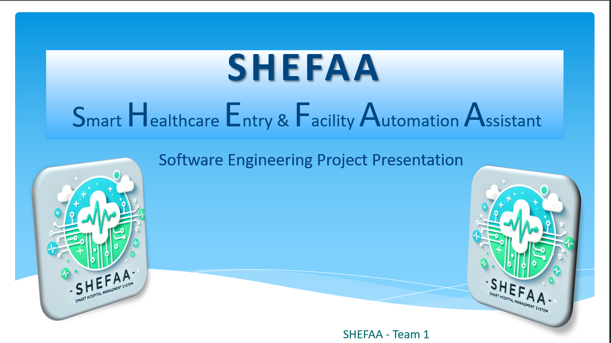
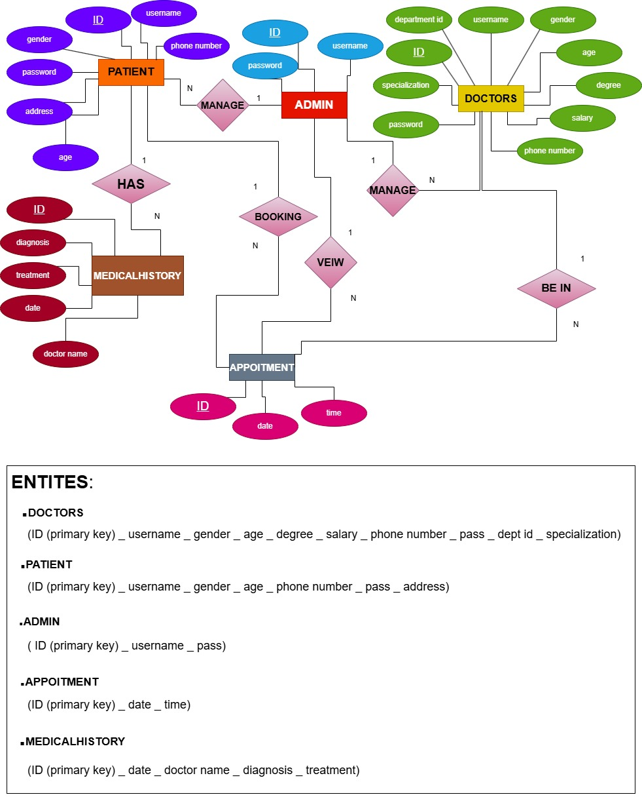
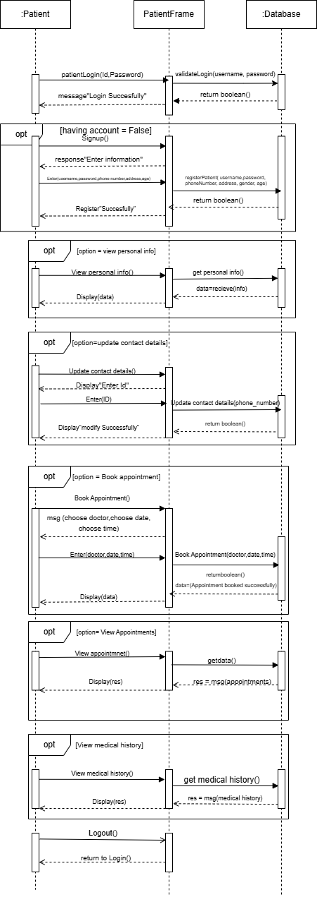

<!-- ===================== -->
<!-- SHEFAA README.md -->
<!-- ===================== -->

<p align="center">
  
</p>

<h1 align="center">🏥 SHEFAA</h1>

<h3 align="center">
Smart Healthcare Entry & Facility Automation Assistant
</h3>

<p align="center">
  <b>Advanced Hospital Management System (HMS)</b><br/>
  Built using Software Engineering principles, UML modeling, secure architecture, and future-ready AI planning.
</p>

<p align="center">
  
  
  
  
  
</p>

---

## 📑 Table of Contents
- [Overview](#-overview)
- [Key Features](#-key-features)
- [System Architecture](#-system-architecture)
- [Interactive Diagrams](#-interactive-diagrams)
- [Technology Stack](#-technology-stack)
- [Project Structure](#-project-structure)
- [Roles & Access Control](#-roles--access-control)
- [Design Patterns](#-design-patterns)
- [Testing Strategy](#-testing-strategy)
- [Future Enhancements](#-future-enhancements)
- [Documentation](#-documentation)
- [Team & Credits](#-team--credits)

---

## 🔍 Overview

**SHEFAA** is a **Smart Hospital Management System** designed to automate and secure healthcare operations such as:

- Patient registration
- Appointment scheduling
- Medical record management
- Administrative control
- AI-powered chatbot guidance

The project follows **industry-level Software Engineering standards**, making it suitable for:
- 🎓 University evaluation
- 💼 Technical portfolios
- 🧑‍💻 Software engineering interviews

---

## 🚀 Key Features

### 👤 Patient
- Self registration & authentication
- Book / cancel appointments
- View medical history
- Update personal data
- AI chatbot for symptom guidance

### 🩺 Doctor
- Secure login
- View daily appointments
- Access patient history
- Write & update medical reports

### 🛠️ Admin
- Manage doctors & patients
- View system-wide appointments
- Enforce role-based access control
- Maintain database integrity

---

## 🧱 System Architecture

<p align="center">
  
</p>

🔹 **Architecture Style**
- Conceptual **MVC (Model–View–Controller)**
- Centralized database
- Modular service classes

---

## 🖱️ Interactive Diagrams

> Click any section to expand (high resolution supported)

<details>
<summary>📘 Use Case Diagram</summary>

<p align="center">
  
</p>
</details>

<details>
<summary>🔄 Activity Diagram</summary>

<p align="center">
  
</p>
</details>

<details>
<summary>🧩 Class Diagram</summary>

<p align="center">
  
</p>
</details>

<details>
<summary>📊 ER Diagram</summary>

<p align="center">
  
</p>
</details>

<details>
<summary>🗂️ Relational Model</summary>

<p align="center">
  
</p>
</details>

<details>
<summary>🔁 Sequence Diagram (Patient Flow)</summary>

<p align="center">
  
</p>
</details>

---

## 🧰 Technology Stack

| Layer | Technology |
|------|-----------|
| Programming Language | Java |
| Database | Microsoft SQL Server |
| Architecture | MVC |
| Design Patterns | Singleton |
| Modeling | UML, ERD, Draw.io |
| Documentation | SRS, DOCX, PDF |

---

## 🗃️ Project Structure

```text
SHEFAA/
│
├── Diagrams/
│   ├── Usecase diagram.jpg
│   ├── ACTIVITY.pdf
│   ├── ER.jpg
│   ├── RELATIONAL MODEL.jpg
│   ├── Patient_Sequence.drawio.png
│
├── Documentation/
│   ├── SRS final.docx
│   ├── SHEFAA_Project_Documentation.docx
│   ├── SHEFAA_Presentation_Styled.pptx
│
├── Design/
│   ├── Class diagram.pdf
│   ├── OBJECT Diagram.jpg
│
└── README.md
```
---
🔐 Roles & Access Control
Role	Permissions
Patient	Register, book appointments, view history
Doctor	View schedule, manage medical reports
Admin	Full system control

✔ Authentication required
✔ Role-based authorization enforced
---
🧠 Design Patterns
🔹 Singleton Pattern

Used in DBConnection

Ensures a single database connection

Improves performance & consistency
---
🔹 MVC Architecture

Model: Database & business logic

View: GUI interfaces

Controller: Service classes
---
🧪 Testing Strategy

Unit Testing (Login, DB)

Integration Testing

Black Box Testing

Boundary Value Testing

White Box (Path Coverage)

Usability Testing
---
🔮 Future Enhancements

🤖 AI-based medical diagnosis

📱 Mobile application (React Native)

🩻 Telemedicine integration

🌍 Multi-branch hospital support

🌐 Arabic / English localization
---
📄 Documentation

📘 SRS
📙 Project Documentation
📊 Final Presentation

All available inside the repository.
---
👥 Team & Credits

Course: Software Engineering
University: Helwan National University
Group: Team 1

This project was developed collaboratively with contributions in:

System analysis

UML modeling

Java implementation

Database design

Testing & documentation
```
<p align="center"> ⭐ <b>If you find this project impressive, consider starring the repository</b> ⭐ </p> ```
